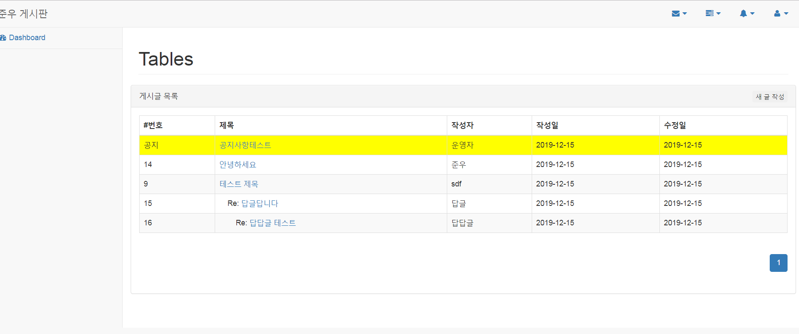
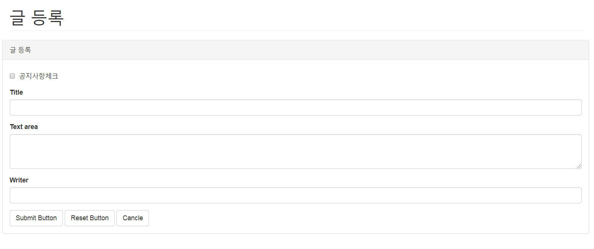
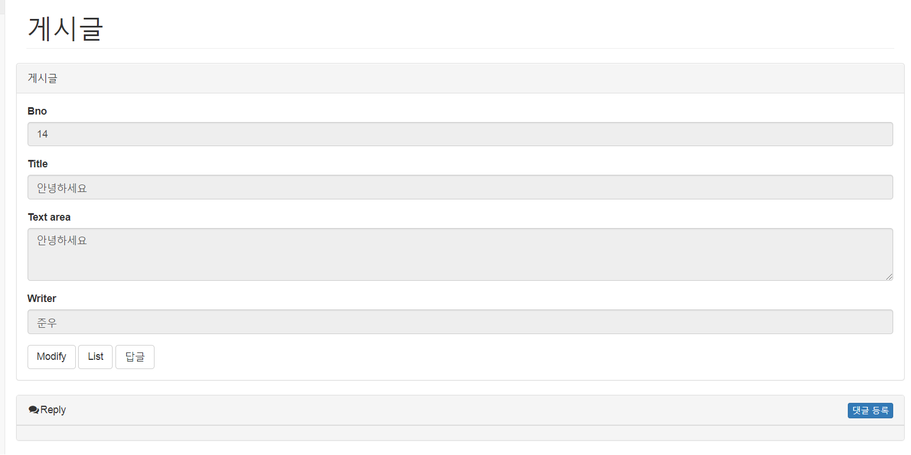
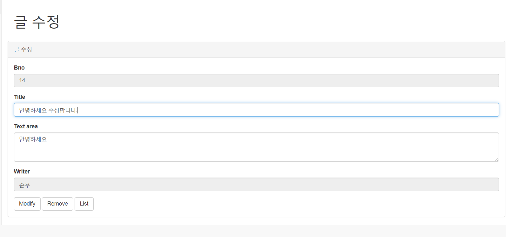
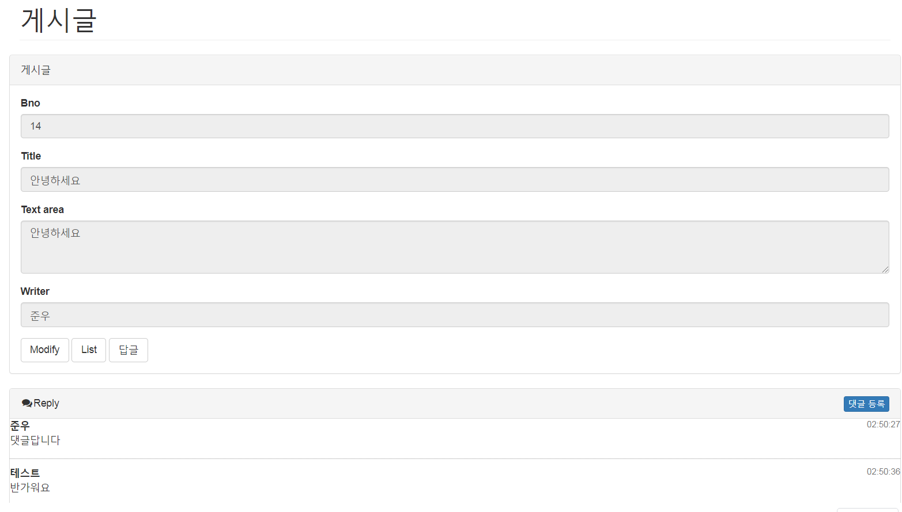

## Springrhk Mybatis를 활용한 게시판

### 개발환경
- JAVA, JSP, Spring, Mybatis, Jquery, Mysql, Bootstrap 

### 주요기능
- 게시글 등록, 수정, 삭제
- 게시글 조회, 목록 페이징 처리
- REST방식으로 댓글, 작성, 수정, 삭제, 페이징 처리
- 게시글 파일 업로드 처리
- 게시글 답글 작성 기능
- 공지사항글 상단 고정

### 메인화면

- 공지글, 기본글, 답글 순으로 정렬

### 게시글 작성

- 공지사항 체크 시 공지글 적용
### 게시글 조회

- 게시글 조회화면에서 수정과 답글 작성으로 이동할 수 있음

### 게시글 수정

- 게시글 수정화면에서 수정과 삭제 가능

### 댓글

